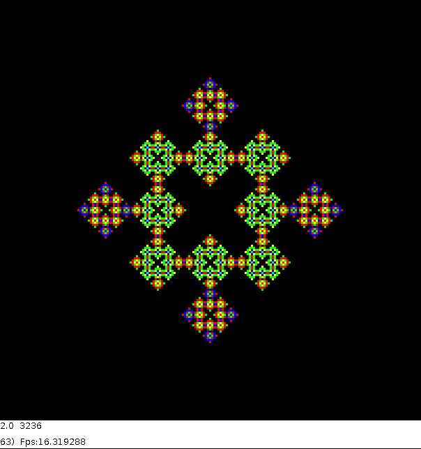
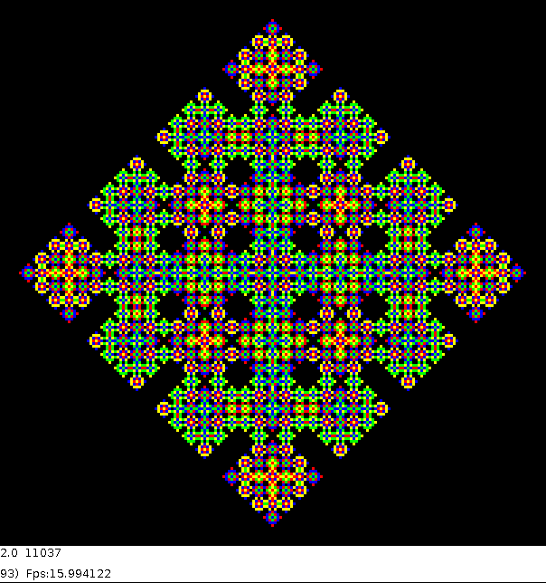

# CA (Cellular Automaton) simulation application template
### @date 2025-04-29 (last modification)

## USAGE

For use with square, discrete, 1 or 2 dimensional geometry.

* Initializes cells to 0 and 1 with given density
* Organizes basic viewing
* Handles keyboard and (potentially) mouse events
* Saves the simulation log file
* Optionally saves the simulation movie in .mp4 format

The template user must define the cell state change rule and accordingly have 
to change the initialization routine and simulation step (CABasics.pde).
It can also change the display colors (ModelVisual.pde)

## Where it can work?

Tested under 
* Ubuntu from 18.04 up to 20.04 with Processing 3.x
* Windows 10 and 11 with Processing 4.x

## See illustration below:

   

  

